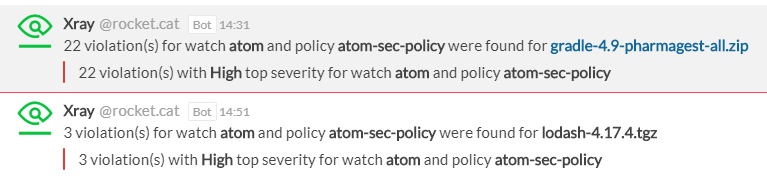

## About

Add [JFrog Xray](https://jfrog.com/xray/) notifications via a new WebHook in Rocket.Chat.

## Receive alerts

1. Create a new **Incoming WebHook**
2. Select the channel where you will receive the alerts. You may wish to create a dedicated channel for your notifications.
3. Select an account from which the alerts will be posted. You may wish to create a dedicated account just for notifications.
4. Set the "Enable Scripts" option to `True`.
5. Copy content of [xray-incoming.js](src/xray-incoming.js) in Script field.
6. Save the integration. This will generate a webhook URL and secret for you.
7. On Xray admin interface, [choose Webhooks](https://www.jfrog.com/confluence/display/XRAY/Configuring+Xray#ConfiguringXray-ConfiguringWebhooks) and add the webhook URL generated in the URL field. Don't forget to create an [automatic action in policies](https://www.jfrog.com/confluence/display/XRAY/Policies#Policies-AutomaticActions.3) to trigger it.

## How can I help ?

All kinds of contributions are welcome :raised_hands:! 
The most basic way to show your support is to star :star2: the project, or to raise issues :speech_balloon: 
But we're not gonna lie to each other, I'd rather you buy me a beer or two :beers:!

 

## License

MIT. See `LICENSE` for more details.
